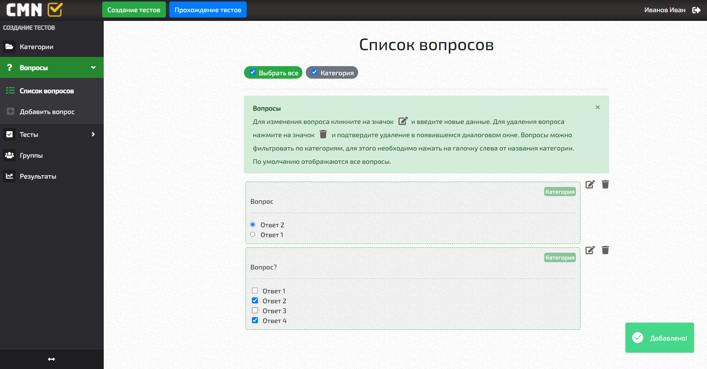
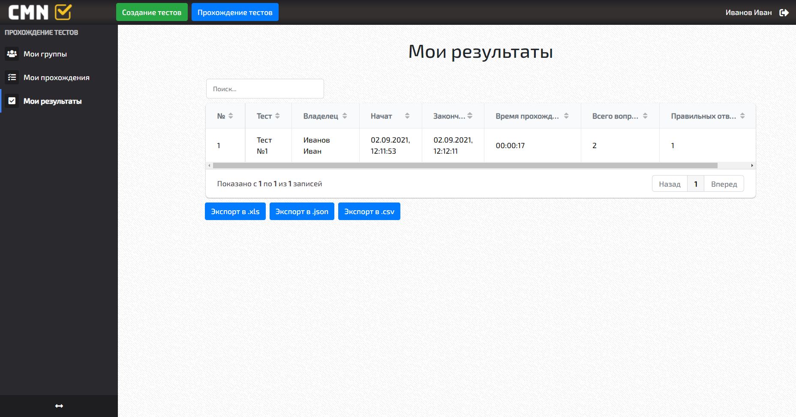

<!-- Иконка -->
 

  

  <h3 align="center">Система тестирования</h3>

  

    Создание тестов, прохождение тестов, информирование о результатах прошедшего тестирования с помощью аналитических отчетов.
     
  

<!-- О проекте-->
## О проекте

Функции:
- Просмотр и учет категорий
- Просмотр и учет вопросов
- Просмотр и учет тестов
- Просмотр и учет групп пользователей
- Просмотр результатов
- Просмотр аналитики по прохождениям тестов
- Возможность выдать группе пользователей тест на прохождение
- Получение ссылки на прохождение теста
- Прохождение теста
- Просмотр своих групп и приглашений в группу
- Просмотр аналитики по своим результатам
- Экспорт результатов в файлы форматов .csv, .json, .xlsx

<!-- Результаты работы программы -->
## Результаты работы программы

<!-- Создано с помощью -->
## Создано с помощью

Client:
* [Vue.js](https://vuejs.org)
* [Vuex](https://vuex.vuejs.org)
* [Vue Router](https://router.vuejs.org)
* [VueSidebarMenu](https://www.npmjs.com/package/vue-sidebar-menu)
* [VueTippy](https://www.npmjs.com/package/vue-tippy)
* [VueJsonExcel](https://www.npmjs.com/package/vue-json-excel)
* [VueToastNotification](https://www.npmjs.com/package/vue-toast-notification)
* [VueModal](https://vue-modal-demo.netlify.app)
* [v-clipboard](https://www.npmjs.com/package/v-clipboard)
* [VueSelect](https://vue-select.org)
* [Bootstrap](https://getbootstrap.com)
* [BootstrapVue](https://bootstrap-vue.org)
* [Firebase](https://firebase.google.com)
* [ApexCharts.js](https://apexcharts.com)

Api:
* [Node.js](https://nodejs.org)
* [Express.js](https://expressjs.com)
* [MongoDB](https://www.mongodb.com)
* [Mongoose](https://mongoosejs.com)
* [Express Mongo Sanitize](https://www.npmjs.com/package/express-mongo-sanitize)
* [cors](https://www.npmjs.com/package/cors)
* [JWT](https://www.npmjs.com/package/jsonwebtoken)
* [bcrypt.js](https://www.npmjs.com/package/bcryptjs)
* [Joi](https://joi.dev)
* [uuid](https://www.npmjs.com/package/uuid)

